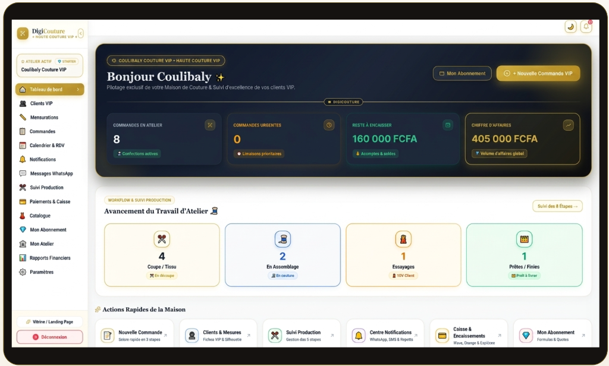
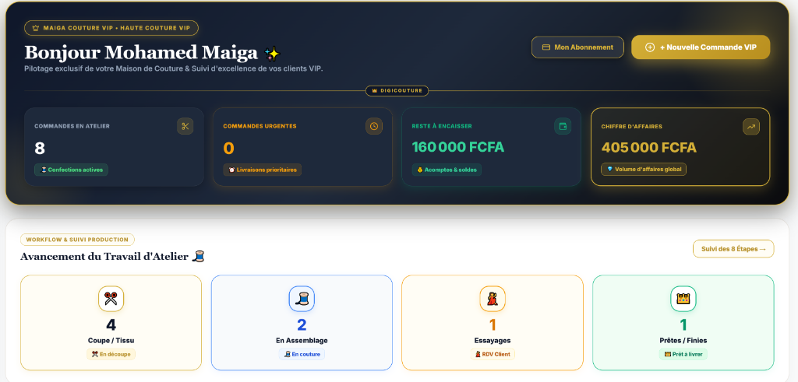
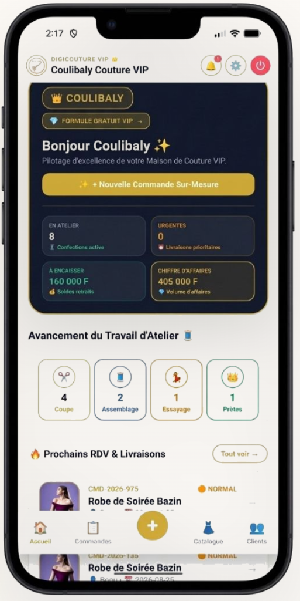

# ✨ DigiCouture VIP — Solution Complète de Gestion d'Atelier de Haute Couture


> **DigiCouture VIP** est la plateforme hybride Web & Mobile de référence conçue pour la digitalisation intégrale des maisons de haute couture, ateliers de création sur-mesure et couturiers professionnels en Afrique de l'Ouest (Côte d'Ivoire `+225` / Devise **FCFA**).

---

## 📸 Aperçu des Interfaces (Web & Mobile)

<div align="center">

### 🌐 Version Web & Cockpit Administration SaaS


<br/>

| 🔑 Page de Connexion Web Haute Couture | 📱 Version Mobile Android (Expo Native App) |
| :---: | :---: |
|  |  |
| *Accès sécurisé Atelier & OTP WhatsApp* | *App Native Android & Affiche QR Code* |

<br/>

### 🖨️ Affiche Catalogue QR Code & Impression A4


</div>

---

## 🌟 Aperçu & Architecture du Projet (Mono-Repo)

DigiCouture est architecturé sous forme de **Mono-Repo unifié** assurant une synchronisation temps réel entre l'application Web, l'application Mobile Expo et le serveur API REST Node.js / MySQL :

```text
DigiCouture/
├── src/                      # 🌐 Application Web (React 19, Vite, TypeScript, Lucide Icons)
│   ├── components/           # Composants métiers (Dashboard, Clients, Commandes, CinetPay, Wizard)
│   ├── admin/                # 👑 Back-Office SaaS Admin (Paiements, Support, Usage, Broadcast)
│   ├── types.ts              # Modèles de données & types TypeScript unifiés
│   └── index.css             # Design System Luxe Haute Couture (Or Impérial & Dark Mode)
├── mobile_app/               # 📱 Application Mobile Native (Expo SDK 54, React Native, TypeScript)
│   ├── App.tsx               # Code principal mobile (Android & iOS - Parité 100% Web)
│   ├── assets/               # Icônes circulaires & Splash screens
│   └── package.json          # Dépendances natives (expo-print, expo-sharing, expo-image-picker)
├── server.js                 # 🚀 Backend REST API (Node.js, Express, MySQL, CinetPay Webhook IPN)
├── .env                      # 🔑 Variables d'environnement (MySQL, Clés API CinetPay)
├── package.json              # Dépendances Web & Scripts de build
└── README.md                 # Documentation officielle du projet
```

---

## ⚡ Fonctionnalités Clés & Innovation Métier

### 📊 1. Workflow de Confection en 8 Étapes Dynamique
Suivi tactile et visuel avec jauge de progression en pourcentage (`0%` à `100% Fait`) et transition progressive sans retour arrière involontaire :
1. 📦 **1. Commande reçue** — Fiche de commande initialisée & acompte enregistré
2. 📏 **2. Mesures prises** — Fiche de mensurations complétée (20+ points anatomiques)
3. ✂️ **3. Découpe** — Cisaillage du Bazin, Pagne Wax ou Soie
4. 🧵 **4. Couture** — Assemblage et piqûre sur machine
5. 🪡 **5. Finitions** — Pose de broderies au fil d'Or, doublures & boutons
6. 👗 **6. Essayage** — Séance d'essayage et retouches en cabine atelier
7. 🟢 **7. Prête** — Tenue cintrée, repassée et prête au retrait
8. ✅ **8. Livrée** — Solde réglé, remise en main propre & reçu délivré

### 🧾 2. Reçus Certifiés Haute Couture & Exports Réels PDF / PNG
- **Format 1 Page A4 / HD Garanti** : Design Orfèvre compact et luxueux avec Médaillon Ciseaux `✂️`, sans chevauchement ni saut de page.
- **Données 100% Dynamiques** : Nom du client, indicatif atelier `🇨🇮 +225`, modèle, tissu, couleur, date de dépôt, date de livraison (`🔴 URGENT`), acompte, moyen de paiement exact (*Wave, Orange Money, Espèces*) et reste à payer en rouge.
- **📄 Export PDF Natif** : Génération d'un document PDF imprimable A4 via `expo-print` et `expo-sharing`.
- **🖼️ Export PNG HD Direct** : Rendu Canvas HD direct et téléchargement du fichier image `.png` dans la galerie photo.
- **🖨️ Impression POS Thermal** : Compatibilité imprimantes thermiques POS-58 / POS-80.
- **📲 QR Code de Suivi Digital** : Code QR intégré (`https://digicouture.app/suivi/...`) permettant au client de consulter l'avancement de sa tenue en temps réel.

### 🔑 3. Authentification Transparente par Code OTP WhatsApp
- Connexion directe par bouton Or **`🔑 Se Connecter à l'Atelier`**.
- Réception directe du code OTP à 4 chiffres sur le numéro WhatsApp de l'atelier sans étape manuelle.

### 💳 4. Guichet de Paiement CinetPay (+225 / FCFA)
Intégration de l'API **CinetPay v2** avec Webhook IPN automatique pour l'encaissement du solde et des acomptes :
- 🟠 **Orange Money Côte d'Ivoire**
- 🟡 **MTN Mobile Money**
- 🔵 **Moov Money**
- 🌊 **Wave Côte d'Ivoire**
- 💳 **Cartes Bancaires Visa & Mastercard**

### 👥 5. Gestion Client & Indicatif Atelier (`🇨🇮 +225`)
- Saisie simplifiée des numéros de téléphone avec badge indicatif pays de l'atelier.
- Carnet de 20+ points de mesures sur-mesure (Poitrine, Épaules, Hanches, Longueur bras, Longueur pantalon/robe...).

---

## 🛠️ Guide d'Installation & Démarrage Rapide

### 1. Prérequis
- **Node.js** (v18.0.0 ou supérieur)
- **npm** (v9.0.0 ou supérieur)
- **Expo Go App** (disponible sur Google Play Store & Apple App Store)
- **MySQL Server** (v8.0+, optionnel — le serveur bascule automatiquement en mode In-Memory si la BD n'est pas disponible)

---

### 2. Variables d'Environnement (`.env`)
Créez un fichier `.env` à la racine du projet :

```env
# 🚀 Serveur & Base de Données
PORT=5000
DB_HOST=localhost
DB_USER=root
DB_PASSWORD=votre_mot_de_passe
DB_NAME=digicouture_db

# 💳 Clés API CinetPay (cinetpay.com)
CINETPAY_API_KEY=VOTRE_CINETPAY_API_KEY
CINETPAY_SITE_ID=VOTRE_CINETPAY_SITE_ID
CINETPAY_SECRET_KEY=VOTRE_CINETPAY_SECRET_KEY

# 🌐 URL Application
APP_URL=http://localhost:5173
```

---

### 3. Installation des Dépendances

```bash
# 1. Dépendances Web & Serveur
npm install

# 2. Dépendances Mobile Native
cd mobile_app
npm install
cd ..
```

---

### 4. Lancement en Mode Développement

#### 📡 Lancer le Serveur API Node.js (Port 5000)
```bash
node server.js
```

#### 🌐 Lancer l'Application Web React Vite (Port 5173)
```bash
npm run dev
```

#### 📱 Lancer l'Application Mobile Expo React Native
```bash
cd mobile_app
npx expo start
```

---

## 📦 Compilation & Build Production

### 🌐 Build Application Web
```bash
npm run build
```
Les fichiers optimisés seront générés dans le dossier `dist/`.

### 📱 Build Application Mobile Android (APK / AAB)
Pour générer l'application au format APK sur votre mobile :
```bash
cd mobile_app
npx eas build -p android --profile preview
```

---

## 🗄️ Structure de la Base de Données MySQL (`digicouture_db`)

- **`ateliers`** : Profils des ateliers, contacts WhatsApp, villes et formules d'abonnement SaaS.
- **`clients`** : Repertoire clients, numéros WhatsApp avec indicatif `+225`, villes et historiques.
- **`measurements`** : Fiches de mensurations sur-mesure (20+ variables).
- **`orders`** : Commandes, modèles, tissus, dates de dépôt/livraison, urgence, acomptes, solde restant et statuts 8 étapes.
- **`payments`** : Trace des paiements CinetPay, Wave et Espèces avec identifiants uniques de transaction.

---

## 📜 Licence & Propriété
Développé avec passion pour l'excellence de la Couture Africaine et la digitalisation des Maisons de Couture.  
Tous droits réservés © 2026 **Maison DigiCouture VIP**.
# DigiCouture

